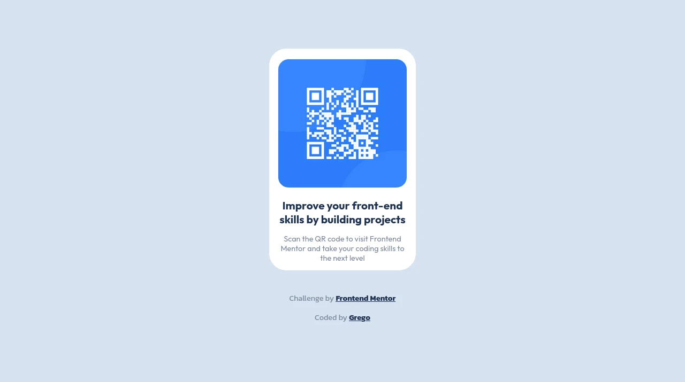
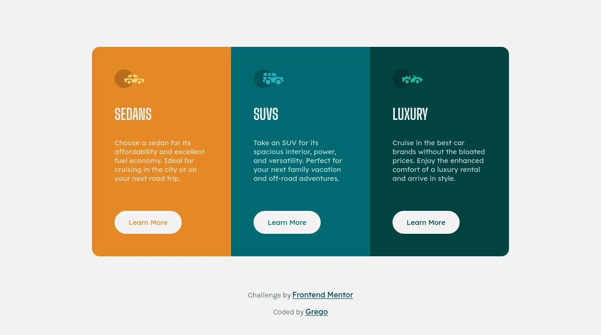
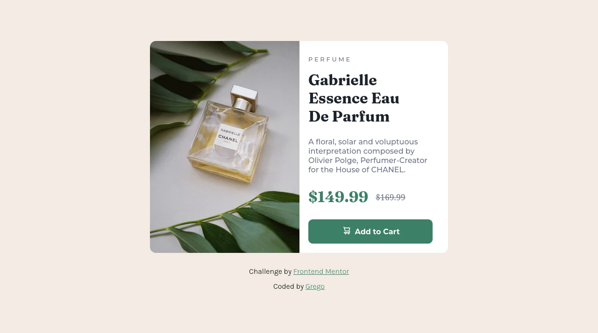

# Frontend Mentor Challenges

## In this repository you will find the challenges that I have completed

### Screenshots | Repository | Live site

#### QR code **|** [**Solution**](https://github.com/Grego14/FrontendMentor_Challenges/tree/main/qr-code-component) **|** [**Live site**]()

#### 3-column **|** [**Solution**](https://github.com/Grego14/FrontendMentor_Challenges/tree/main/3-column-preview-card-component-main) **|** [**Live site**]()

#### Product card **|** [**Solution**](https://github.com/Grego14/FrontendMentor_Challenges/tree/main/product-preview-card-component-main) **|** [**Live site**]()

<!--#### Results summary **|** [**Solution**](https://github.com/Grego14/Frontend-Mentor/tree/main/results-summary-component-main) **|** [**Live site**]()-->

<!---->

### Author

- Frontent Mentor Profile [@Grego14](https://www.frontendmentor.io/profile/Grego14)
