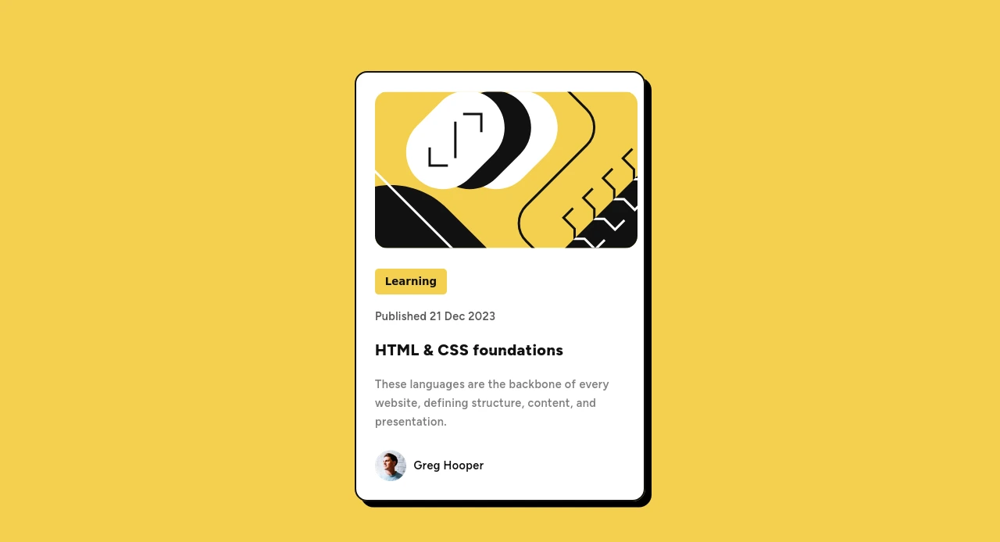

# Frontend Mentor - Blog preview card solution

This is a solution to the [Blog preview card](). Frontend Mentor challenges help you improve your coding skills by building realistic projects.

## Overview

### Screenshot

### Links

[Solution]() | [Live Site]()

## My process

### Built with

- Semantic HTML5 markup
- CSS3 custom properties
- Flexbox

## Author

- Frontend Mentor - [@Grego14](https://www.frontendmentor.io/profile/Grego14)
