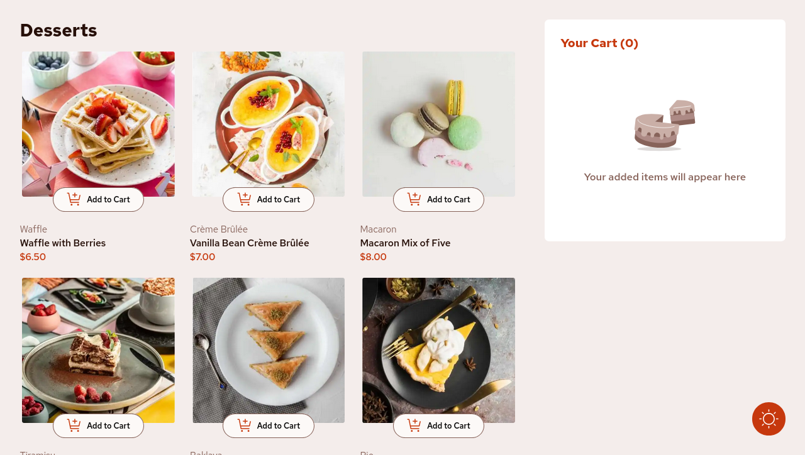
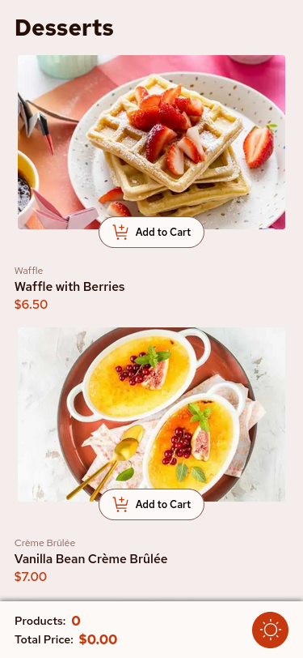

# Frontend Mentor - Product list with cart solution

This is a solution to the [Product list with cart challenge on Frontend Mentor](https://www.frontendmentor.io/challenges/product-list-with-cart-5MmqLVAp_d). Frontend Mentor challenges help you improve your coding skills by building realistic projects. 

## Table of contents

- [Overview](#overview)
  - [The challenge](#the-challenge)
  - [Screenshot](#screenshot)
  - [Links](#links)
- [My process](#my-process)
  - [Built with](#built-with)
  - [What I learned](#what-i-learned)
  - [Continued development](#continued-development)
  - [Useful resources](#useful-resources)
- [Author](#author)

## Overview

### The challenge

Users should be able to:

- Add items to the cart and remove them ✅
- Increase/decrease the number of items in the cart ✅
- See an order confirmation modal when they click "Confirm Order" ✅
- Reset their selections when they click "Start New Order" ✅
- View the optimal layout for the interface depending on their device's screen size ✅
- See hover and focus states for all interactive elements on the page ✅

### Screenshot

    
    

### Links

[Solution](https://github.com/Grego14/FrontendMentor_Challenges/tree/main/challenges/product-list-with-cart-main) **|** [Live Site](https://product-cart-with-list.netlify.app/)

## My process

### Built with

- Semantic HTML5 markup
- CSS custom properties
- Flexbox
- CSS Grid
- Mobile-first workflow
- [React](https://reactjs.org/) - JS library
- [Motion](https://motion.dev) library

### What I learned

This is my first completed project using ReactJS, i learned a lot of things.

How to use **Motion** library to implement cool transitions/animations.

React **built-in** hooks useState, useEffect, useRef, useReducer, useContext, useCallback and useId. Also how to create custom hooks!

How to use **forwardRef** when creating the **Cart** and the **Products** components.

Implement use of the Context API to make the styles. But then I removed them and ended up using CSS classes

Improved performance using these techniques:

1.  Dynamic import some components using **React.lazy** and **React.Suspense**
2.  Memoization using **React.memo**.
3.  Using react states to handle in-app states and download components when they change 
    *(loading the Cart when the 3 first products images are loaded... etc)*

#### Features:

1. Toggle Theme Button. *(light, dark themes)*

2. Component to let users see their order *(products count and total price, just for mobile devices)*

3. Max product quantity using Math.random and localStorage *(to avoid infinite quantitys)*

4. -20% Discount when using the valid code. *(Visible only when clicking the
   "click here" message after adding to cart at least one product)*

5. Sorting products on the cart *(order, cheaper, expensive)*.

## Continued development

-   Learn more about the motion library to create better animations at the 
    time when components appear/disappear and when a button is pressed, etc.

-   Better ways to manage state.

-   How to properly structure an app.

## Author

- Frontend Mentor - [@Grego14](https://www.frontendmentor.io/profile/Grego14)
- Github Profile - [Grego14](https://github.com/Grego14)
